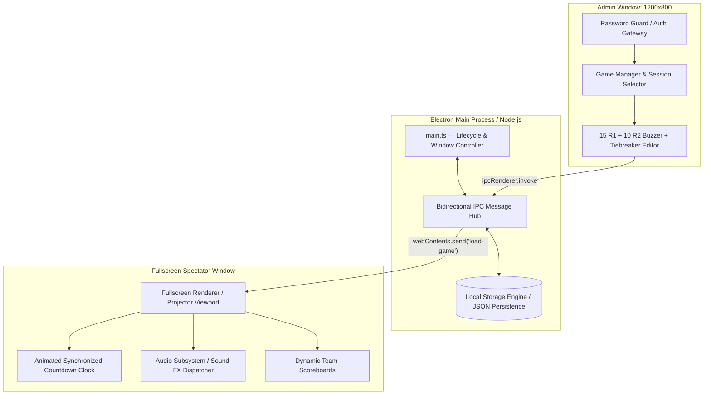

# 🏆 GRIP League — Desktop Competition & Tournament Engine

[]()
[]()
[]()
[-0078D4?style=for-the-badge&logo=windows&logoColor=white)]()

A standalone desktop competition management system and live presentation board engineered in **Electron** and **TypeScript**. Designed specifically for high-stakes academic quiz bowls, medical leagues, and tournament competitions where venue internet connectivity is unreliable or nonexistent.

---

## 🏛️ System Architecture: Dual-Process IPC Pipeline

GRIP League decouples administration from live spectator rendering through Electron's Inter-Process Communication (IPC) bus. This ensures operator actions never introduce frame-drops or UI stuttering on the live presentation display.



---

## 🛠️ Core Features

* **Dual-Window Orchestration:**
  * **Operator Console:** Password-protected (`admin123`) window for queuing questions, manual point overrides, and round management.
  * **Fullscreen Spectator Board:** Designed for 1080p/4K auditorium projectors with high-contrast podium cards, question displays, and live timers.
* **Competition Formats:**
  * **Round 1:** 15 multiple-choice category questions.
  * **Round 2:** 10 rapid-fire buzzer lockout rounds.
  * **Audience Polls & Tie-Breakers:** Speed rounds and contingency question banks.
* **100% Offline Resilience:** Utilizes local filesystem persistence (`games.json` in OS `userData`), ensuring seamless operation even if venue Wi-Fi fails completely.
* **Integrated Audio Engine:** Synchronized sound effects for game start, timer countdowns, correct buzzes, and wrong answer penalties.
* **Cross-Compilation:** Configured with `electron-builder` to package standalone Windows installers (`.exe` via NSIS).

---

## 🚀 Quick Start

### Prerequisites
* [Node.js](https://nodejs.org/) (v18 or higher)
* `npm`

### Installation
```bash
# Clone the repository
git clone https://github.com/MuhammadRayyan08/grip-league.git
cd grip-league

# Install dependencies
npm install
```

### Development
```bash
# Compile TypeScript and start Electron with hot reload
npm start
```

### Packaging & Distribution
```bash
# Compile and build Windows NSIS installer
npm run dist
```

---

## 📁 Project Structure

```
grip-league/
├── src/
│   ├── main/
│   │   └── main.ts          # Main Electron process, window management, IPC handlers
│   ├── types/
│   │   └── index.ts         # TypeScript interfaces for games, rounds, and teams
│   ├── utils/
│   │   └── storage.ts       # Atomic JSON persistence engine
│   └── renderer/
│       ├── admin/           # Operator UI (login, game creator, dashboard)
│       ├── game/            # Spectator presentation engine and sound controls
│       └── styles/          # Global styles and layout tokens
├── public/
│   ├── Audio/               # Sound effect assets (.mp3)
│   └── Logo.ico             # Application icon
├── package.json             # Build configuration and electron-builder spec
└── tsconfig.json            # TypeScript compiler configuration
```

---

## 📄 License
This project is licensed under the [MIT License](LICENSE).
