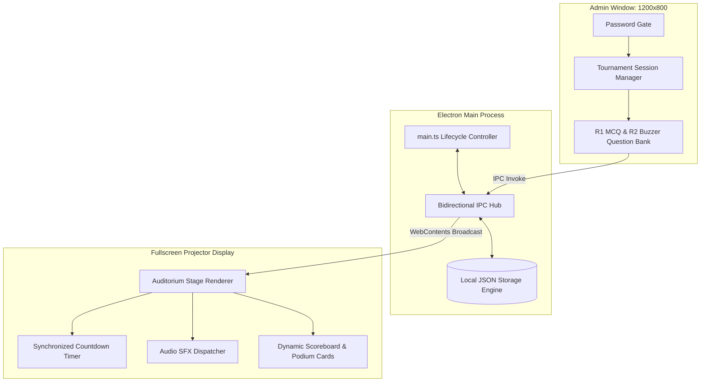

# GRIP League — Desktop Tournament & Competition Engine

[]()
[]()
[]()
[-0078D4?style=flat-square)]()

Standalone desktop competition management system and live presentation board engineered with Electron and TypeScript. Designed for high-stakes academic quiz bowls and tournament competitions where venue internet connectivity is unreliable or unavailable.

---

## Role & Ownership

* **Role:** Sole Developer (Independent Project)
* **Scope:** Full-stack engineering across Electron main process, IPC message hub, admin control console, stage presentation renderer, and local filesystem JSON persistence.

---

## System Architecture



---

## Key Capabilities

* **Dual-Window Architecture:** Decouples operator administration (manual scoring, question queuing, buzzer resets) from the fullscreen 1080p/4K projector stage display via asynchronous IPC events.
* **100% Offline Persistence:** Stores competition state, team rosters, and question banks in local filesystem storage (`userData/games.json`), ensuring uninterrupted execution without cloud dependency.
* **Tournament Modes:** Multi-tier quiz engine supporting 15-question multiple choice rounds, 10-question buzzer lockouts, audience polls, and sudden-death tiebreakers.
* **Synchronized Audio Engine:** Low-latency Web Audio sound triggers for timers, buzzer hits, correct answers, and penalty flags.

---

## Tech Stack

* **Runtime:** Electron, Node.js
* **Language:** TypeScript, HTML5, Modern CSS
* **Storage:** Local JSON filesystem persistence
* **Packaging:** electron-builder (standalone Windows NSIS installer)

---

## Quick Start

```bash
git clone https://github.com/MuhammadRayyan08/grip-league.git
cd grip-league
npm install
npm start      # Launch dev environment
npm run dist   # Package Windows executable (.exe)
```

---

## License

Released under the [MIT License](LICENSE).
